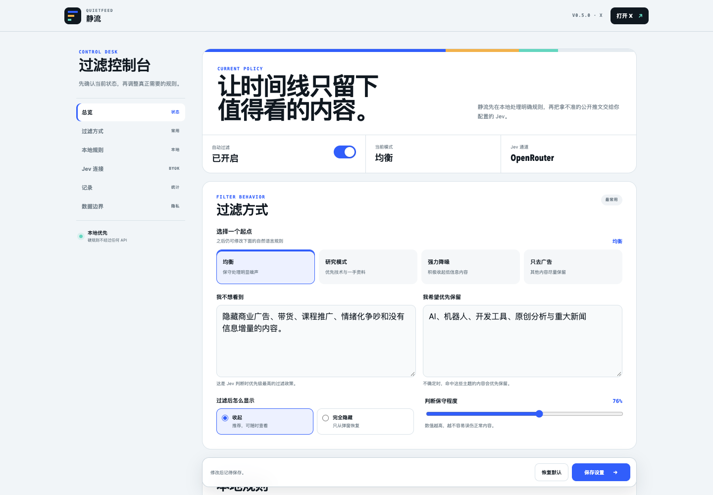

# Jingliu（静流）— AI Feed Filter

> 安静信息流，留下真正重要的内容。

[English](README.md) · 简体中文

Jingliu（静流）是一个本地优先、用户自带 Jev 的 AI 信息流过滤器。它先在浏览器中处理广告标签、关键词和作者规则，只把本地无法确定的公开内容交给用户配置的 TypeSafe、OpenRouter 或自定义兼容接口。

X / Twitter 是第一个已经可用的平台适配器，而不是产品的最终边界。静流的核心过滤逻辑与平台页面适配层相互独立，后续会继续支持更多信息流平台。

[](https://github.com/shirenchuang/jingliu/actions/workflows/ci.yml)
[](LICENSE)

官网：[中文](https://jingliu.srcsxx.workers.dev/) · [English](https://jingliu.srcsxx.workers.dev/en)



## 为什么做静流

大多数信息流工具替你决定什么值得看。静流把决定权留给用户：规则、模型、API Key 和过滤强度都由用户控制；内容默认只折叠、不删除，可以随时查看或纠正。

## 已实现

- 自动过滤 X / Twitter 当前页面和滚动加载的新内容
- 本地广告标签、关键词、作者黑白名单
- 均衡、研究、强力降噪、只去广告四种预设
- TypeSafe Jev、OpenRouter Jev 与自定义 SystemOne 兼容端点
- 用户自带 API Key，保存在 `chrome.storage.local`
- 低置信度保护、单条恢复、整页恢复与重新扫描
- 安全导入导出过滤规则，不包含 API Key、历史记录或推文内容
- 适配 X 虚拟列表和 DOM 节点复用
- 无账号、无遥测、无静流中转服务器

## 下载与安装渠道

| 渠道 | 状态 | 说明 |
| --- | --- | --- |
| [GitHub Releases](https://github.com/shirenchuang/jingliu/releases/latest) | ✅ 已提供 | 当前公开测试版，下载 ZIP 后通过开发者模式加载 |
| Chrome Web Store | 🚧 准备中 | 上架后支持普通用户一键安装和自动更新 |
| Microsoft Edge Add-ons | 🧭 规划中 | 完成跨浏览器验证后提交 |
| Firefox Add-ons | 🧭 规划中 | 需要完成 WebExtension 兼容适配 |

### 安装当前测试版

1. 从 [Releases](https://github.com/shirenchuang/jingliu/releases) 下载最新 ZIP 并解压。
2. 在 Chrome 打开 `chrome://extensions`。
3. 开启右上角“开发者模式”。
4. 点击“加载已解压的扩展程序”，选择包含 `manifest.json` 的文件夹。
5. 打开或刷新 `https://x.com/home`。

Chrome Web Store 版本尚未发布，当前版本适合开发者和愿意手动安装的测试用户。

## 支持平台

| 平台 | 状态 | 计划 |
| --- | --- | --- |
| X / Twitter 网页版 | ✅ Beta | 已支持自动过滤、持续滚动与虚拟列表 |
| Reddit | 🧭 规划中 | 社区、帖子和推广内容适配器 |
| YouTube | 🧭 规划中 | 首页推荐、搜索结果和评论适配器 |
| LinkedIn | 🧭 规划中 | 首页信息流和推广内容适配器 |
| 通用网页信息流 | 🔬 探索中 | 可配置提取器与第三方平台适配 SDK |

## 工作方式

```text
X 当前页面
    │
    ▼
浏览器本地规则 ── 明确结果 ──▶ 保留 / 折叠
    │
    └── 无法确定 ──▶ 用户配置的 Jev ──▶ 保留 / 折叠 / 隐藏
```

静流官网只提供说明和安装包。扩展请求由用户浏览器直接发往用户选择的服务商，不经过静流服务器。

## 项目结构

```text
extension/            Chrome Manifest V3 扩展与测试
website/              可直接静态部署的产品官网
scripts/              发行打包脚本
.github/workflows/    CI 与 GitHub Pages 部署
```

## 本地开发

```bash
cd extension
npm install
npm run check
npm test
npm run test:e2e
```

扩展不需要构建即可加载。生成可发布 ZIP：

```bash
npm run package
```

输出位于 `dist/`，并同步到官网的 `website/downloads/`。

## 路线图

- 提交 Chrome Web Store，随后评估 Edge 与 Firefox 商店
- 增加 Reddit、YouTube、LinkedIn 等平台适配器
- 提供清晰的平台适配器接口，让社区贡献新平台
- 增加英文界面和浏览器商店本地化资料
- 支持规则导入导出
- 改进模型成本与调用频率控制
- 在不破坏本地优先原则的前提下探索可选同步

## 隐私与安全

请先阅读 [PRIVACY.md](PRIVACY.md) 和 [SECURITY.md](SECURITY.md)。不要在 Issue、日志或截图中提交真实 API Key。

## 参与贡献

欢迎提交 Bug、平台适配器、文档和交互改进。开始前请阅读 [CONTRIBUTING.md](CONTRIBUTING.md)。

## License

[MIT](LICENSE) © 2026 石臻及 Jingliu 贡献者。
